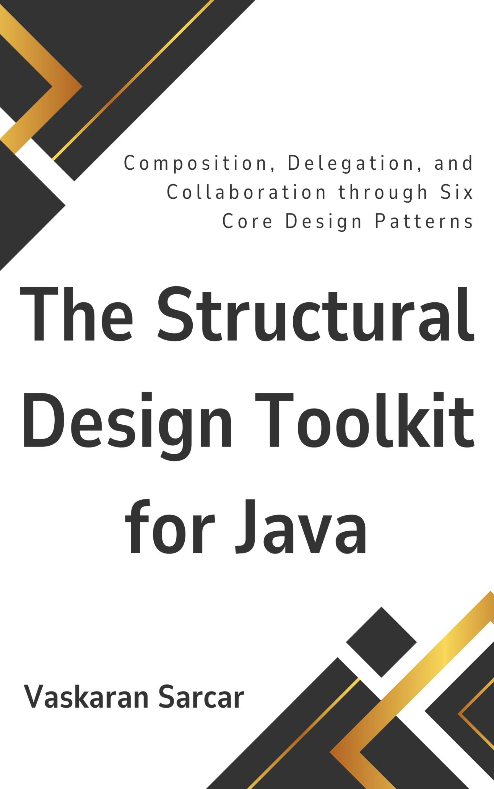

# The Structural Design Toolkit for Java Source Code

This repository accompanies [*The Structural Design Toolkit for Java*](https://www.amazon.com/dp/B0GMKZD9NY) by Vaskaran Sarcar.

[comment]: #cover

Download the files as a zip using the green button, or clone the repository to your machine using Git.

## Releases

Release v1.0 corresponds to the code in the published book, without corrections or updates.

## Contributions

See the file Contributing.md for more information on how you can contribute to this repository.
Notes (for you, not part of README)

